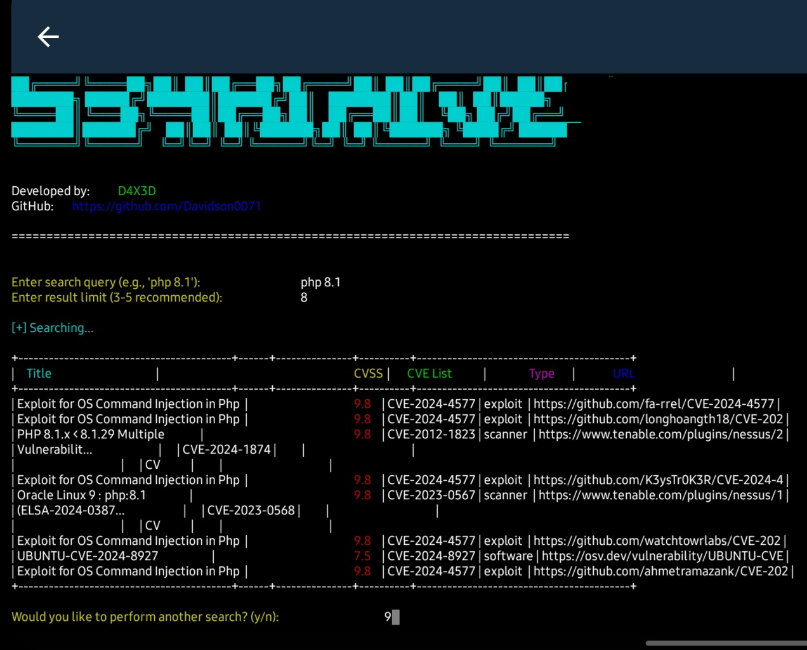

[](https://forthebadge.com)
[](https://forthebadge.com)


# 534rchCVE

## About
534rchCVE is a powerful command-line tool for searching and displaying vulnerability information using the Vulners API. It provides a user-friendly interface with color-coded output and formatted tables for easy readability.

## Features
- 🔑 Up to Date with latest exploits ✅️
- ♾️ Provides link to exploit 
- 📊 Formatted tables using PrettyTable
- 🔄 Multiple search capability in one session
- ⚡ Fast and efficient searching

## Installation

### Prerequisites
- Python 3.x
- pip package manager

### Setup
1. Clone the repository:
```bash
git clone https://github.com/Davidson0071/534rchcve.git
cd 534rchcve
```

2. Install dependencies:
```bash
pip install -r requirements.txt
```

3. Get your Vulners API key from [Vulners](https://vulners.com/)

## Usage

1. Run the tool:
```bash
python searchcve.py
```

2. On first run, enter your Vulners API key when prompted
3. Enter your search query (e.g., 'php 8.1')
4. Specify the number of results you want (3-5 recommended)
5. Review the color-coded results:
   - 🔴 Red: High CVSS (≥7.0)
   - 🟡 Yellow: Medium CVSS (4.0-6.9)
   - 🟢 Green: Low CVSS (<4.0)

## Output Format
The tool displays:
- Vulnerability Title
- CVSS Score
- Associated CVE IDs
- Vulnerability Type
- Reference URL

## Contributing
Contributions are welcome! Please feel free to submit a Pull Request.

## Author
**D4X3D**
- GitHub: [Davidson0071](https://github.com/Davidson0071)

## Kindly leave a Star 🌟  for effort 👌

## Disclaimer
This tool is for educational and research purposes only. Users are responsible for complying with applicable laws and regulations. hack responsibly
